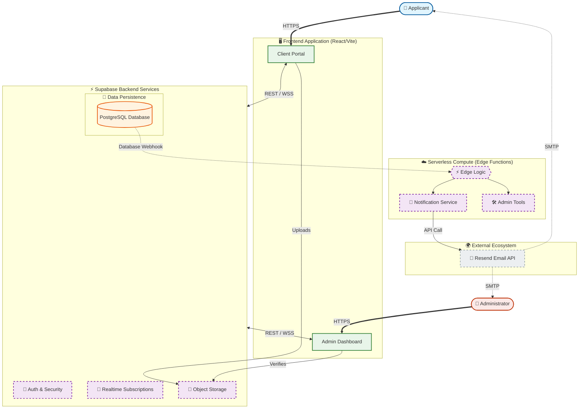

# MMR Burwan - Marriage Registration Portal


**MMR Burwan** (Marriage Registrar Burwan) is a comprehensive, enterprise-grade digital platform designed to digitize and streamline the marriage registration process for the region of Burwan. It replaces legacy manual paperwork with a secure, transparent, and automated digital workflow, serving both citizens (applicants) and government officials (administrators).

---

## 📚 Table of Contents
1. [Project Overview](#-project-overview)
2. [System Architecture](#-system-architecture)
3. [Key Features & Workflows](#-key-features--workflows)
4. [Database Schema & Data Model](#-database-schema--data-model)
5. [Security & Privacy](#-security--privacy)
6. [Folder Structure](#-folder-structure)
7. [Getting Started & Deployment](#-getting-started--deployment)

---

## 🔭 Project Overview

The platform serves two primary user groups with distinct interfaces and permissions:

### 1. Applicants (Citizens)
- **Digital Application**: A guided, multi-step wizard to submit marriage details (Groom, Bride, Witnesses).
- **Document Vault**: Secure upload and management of ID proofs (Aadhaar, Voter ID, etc.).
- **Appointment Booking**: Real-time slot booking for physical verification at the registrar's office.
- **Status Tracking**: Live updates on application status (Draft → Submitted → Verified/Rejected).
- **Certificate Access**: Instant download of digitally signed marriage certificates.

### 2. Administrators (Officials)
- **Command Center**: A dashboard view of all applications with filtering and sorting.
- **Proxy Applications**: Ability to create accounts and applications on behalf of citizens (Walk-in applicants).
- **Verification Suite**: Tools to view documents side-by-side with application data for verification.
- **Rejection Management**: Granular rejection system with automated email notifications explaining the reason.
- **Certificate Issuance**: 
    - One-click generation of unique, traceable certificate numbers.
    - Automatic PDF generation with QR codes.
    - Strict duplicate prevention and history management.

---

## 🏗 System Architecture

The project follows a **Modern Serverless Architecture** leveraging the **Supabase** ecosystem. This ensures high availability, scalability, and zero server management overhead.

### Tech Stack
- **Frontend**: 
    - **Framework**: React 18 (Vite) for high performance.
    - **Language**: TypeScript for type safety.
    - **Styling**: Tailwind CSS for responsive, utility-first design.
    - **State Management**: React Context API.
    - **PDF Generation**: `@react-pdf/renderer` for client-side certificate generation.
    - **Internationalization**: `react-i18next` (English & Bengali).
    - **Testing**: `Vitest` and `React Testing Library`.
- **Backend (BaaS)**: 
    - **Supabase**: Provides Auth, Database, Storage, and Realtime subscriptions.
- **Compute (Serverless)**: 
    - **Supabase Edge Functions**: Deno-based serverless functions for backend logic (Email sending, Proxy user creation).
- **Communication**: 
    - **Resend.com**: Transactional email API for reliable delivery.

### Architecture Diagram


---

## 🚀 Key Features & Workflows

### A. The Application Lifecycle
1.  **Drafting**: Users start an application. Data is validated strictly using `Zod` schemas.
2.  **Submission**: Once submitted, the application is locked and moves to the Admin queue.
3.  **Review**: Admins review the data.
    - **Rejection**: Status reverts, user is notified via email to correct specific errors.
    - **Verification**: Status becomes `verified`. Certificate is generated.

### B. Event-Driven Notification System
We utilize an **Event-Driven Architecture** to decouple the frontend from side effects.
- **Mechanism**: 
    1. Admin performs an action (e.g., rejects a document).
    2. Frontend inserts a record into the `notifications` table.
    3. **Database Webhook** triggers an **Edge Function**.
    4. Email is sent via Resend.
- **Benefit**: Ensures reliability even if the client-side session is interrupted.

### C. Certificate Management
- **Generation**: Certificates are generated as PDF files with unique serial numbers.
- **Synchronization**: Updating a certificate number automatically regenerates the PDF and updates database records, ensuring consistency.
- **Security**: Old certificate files are automatically deleted to prevent data leaks.

---

## 💾 Database Schema & Data Model

The core data model is built on **PostgreSQL**. Key tables include:

| Table Name | Description | Key Relationships |
| :--- | :--- | :--- |
| `users` | Extends Supabase Auth with app-specific profile data. | `id` references `auth.users` |
| `applications` | The central record for a marriage registration. | `user_id` references `users` |
| `certificates` | Stores issued certificate metadata and file URLs. | `application_id` references `applications` |
| `documents` | Metadata for uploaded files. | `belongs_to` references `applications` |
| `appointments` | Booking slots and status. | `user_id` references `users` |
| `notifications` | System alerts and email trigger logs. | `user_id` references `users` |

---

## 🛡 Security & Privacy

1.  **Row Level Security (RLS)**:
    - **Applicants** can ONLY access their own data (`auth.uid() = user_id`).
    - **Admins** have elevated privileges via a custom `is_admin()` function.
    
2.  **Secure Storage**:
    - Documents are stored in private Supabase Storage buckets (`applications`, `certificates`).
    - Accessed only via short-lived **Signed URLs**.

3.  **Validation**:
    - Strict backend validation prevents duplicate certificate numbers.

---

## 📂 Folder Structure

```
mmr-burwan/
├── src/
│   ├── components/       # Reusable UI components
│   │   ├── admin/        # Admin-specific components (tables, modals)
│   │   ├── application/  # Application form steps
│   │   └── ui/           # Generic UI elements (Buttons, Inputs)
│   ├── contexts/         # Global state (Auth, Notifications)
│   ├── data/             # Static data (Districts, Options)
│   ├── hooks/            # Custom React hooks
│   ├── pages/            # Route components
│   │   ├── admin/        # Admin pages (Dashboard, Verification)
│   │   └── dashboard/    # User dashboard
│   ├── services/         # API service layer (admin.ts, certificates.ts)
│   ├── types/            # TypeScript interfaces
│   └── utils/            # Helpers (certificateGenerator.ts)
├── supabase/
│   ├── functions/        # Deno Edge Functions
│   └── migrations/       # SQL migration files
└── public/               # Static assets
```

---

## 🚦 Getting Started & Deployment

### Prerequisites
- Node.js (v18+)
- Supabase CLI

### Local Development

1.  **Clone the repository**
    ```bash
    git clone https://github.com/yourusername/mmr-burwan.git
    cd mmr-burwan
    ```

2.  **Install dependencies**
    ```bash
    npm install
    ```

3.  **Environment Setup**
    Create a `.env` file:
    ```env
    VITE_SUPABASE_URL=your_project_url
    VITE_SUPABASE_ANON_KEY=your_anon_key
    ```

4.  **Run Locally**
    ```bash
    npm run dev
    ```

5.  **Run Tests**
    ```bash
    npm run test
    ```

### Deployment

1.  **Frontend**: Deploy to Vercel, Netlify, or any static host.
2.  **Backend**:
    - Link your local project to your Supabase project:
      ```bash
      supabase link --project-ref your-project-id
      ```
    - Push database migrations:
      ```bash
      supabase db push
      ```
    - Deploy Edge Functions:
      ```bash
      supabase functions deploy
      ```

---

## 📄 License

This project is licensed under the MIT License.
