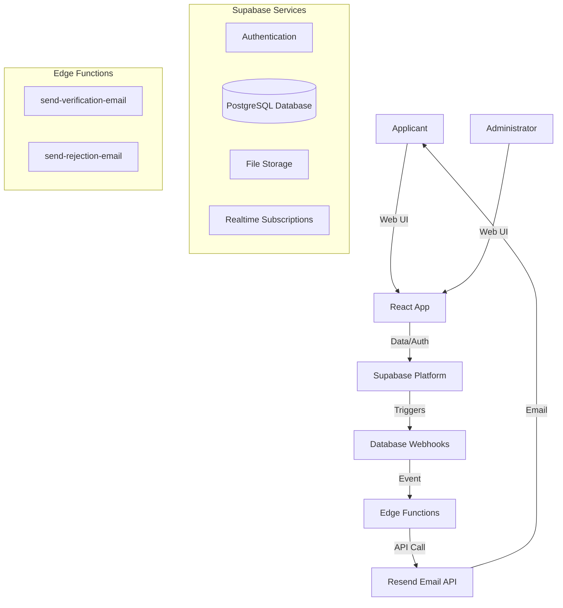

# MMR Burwan - Marriage Registration Portal


**MMR Burwan** (Marriage Registrar Burwan) is a comprehensive digital platform designed to streamline the marriage registration process. It replaces manual paperwork with a secure, transparent, and automated digital workflow, serving both applicants and administrators.

---

## � Table of Contents
- [Project Overview](#-project-overview)
- [System Architecture](#-system-architecture)
- [Key Features & Workflows](#-key-features--workflows)
- [Technical Highlights](#-technical-highlights)
- [Getting Started](#-getting-started)

---

## 🔭 Project Overview

The platform serves two primary user groups:
- **Applicants**: Citizens applying for marriage registration, uploading documents, booking appointments, and downloading certificates.
- **Administrators**: Officials responsible for verifying applications, checking documents, and issuing certificates.

The goal is to digitize the entire lifecycle of a marriage registration, from application to certificate issuance, ensuring data integrity and ease of access.

---

## 🏗 System Architecture

The project follows a **Modern Serverless Architecture** leveraging the **Supabase** ecosystem for backend services and **React** for the frontend.

### Tech Stack
- **Frontend**: React (Vite), TypeScript, Tailwind CSS.
- **Backend / Database**: Supabase (PostgreSQL).
- **Compute**: Supabase Edge Functions (Deno).
- **Storage**: Supabase Storage (for document uploads).
- **Email Service**: Resend.com (integrated via Edge Functions).
- **Authentication**: Supabase Auth.

### Architecture Diagram


---

## 🚀 Key Features & Workflows

### A. Application Process
1.  **Registration**: Users sign up via email/password.
2.  **Form Submission**: A multi-step form captures Groom, Bride, and Witness details.
3.  **Document Upload**: Secure upload of ID proofs (Aadhaar, Voter ID, etc.) to Supabase Storage.
4.  **State Management**: Application status moves from `draft` -> `submitted` -> `pending`.

### B. Admin Verification (The Core Workflow)
The admin dashboard allows officials to review applications with a focus on efficiency.
- **Document Review**: Admin views uploaded files directly in the dashboard.
- **Rejection Flow**:
    - If a document is invalid, Admin rejects it with a specific reason.
    - **System Action**: A `document_rejected` notification is created.
    - **Automation**: Database Webhook triggers `send-rejection-email` Edge Function.
    - **Result**: User receives an email with the specific reason and next steps.
- **Verification Flow**:
    - If all details are correct, Admin clicks "Verify".
    - **System Action**: Application status updates to `verified`.
    - **Automation**: Database Webhook triggers `send-verification-email` Edge Function.
    - **Result**: User receives a success email.

### C. Appointment Booking
- Users can book slots for physical verification/signing.
- **Logic**: Frontend fetches available slots from `appointments` table.
- **Concurrency**: Real-time checks prevent double booking.

### D. Certificate Generation
- Once verified, a unique **Certificate Number** is generated (Format: `WB-MSD-BRW-XXXX`).
- Users can download the digital certificate.
- **Public Verification**: Anyone can verify a certificate's authenticity via the `/verify` public route using the certificate number.

---

## 💡 Technical Highlights

### Event-Driven Notification System
Instead of the frontend directly sending emails (which is fragile and insecure), the system uses an **Event-Driven Architecture**.
- **Source of Truth**: The Database.
- **Trigger**: Data changes (`INSERT` on notifications, `UPDATE` on applications).
- **Benefit**:
    - **Reliability**: If the admin's browser crashes after clicking "Verify", the email still sends because the DB update happened.
    - **Decoupling**: Frontend logic is simpler; it just updates data. Backend handles side effects.
    - **Security**: API keys (Resend) are stored in secure server-side environment variables, never exposed to the client.

### Security & Privacy
- **Row Level Security (RLS)**: PostgreSQL policies ensure users can only see their own data. Admins have elevated privileges via specific roles.
- **Secure Storage**: Documents are stored in private buckets, accessible only via signed URLs generated on-demand.

### User Experience (UX)
- **Internationalization (i18n)**: Support for multiple languages (English/Bengali) via `react-i18next`.
- **Responsive Design**: Mobile-first UI using Tailwind CSS.
- **Real-time Feedback**: Toast notifications and live status updates.

---

## 🚦 Getting Started

### Prerequisites
- Node.js (v16+)
- Supabase CLI

### Installation

1.  **Clone the repository**
    ```bash
    git clone https://github.com/yourusername/mmr-burwan.git
    cd mmr-burwan
    ```

2.  **Install dependencies**
    ```bash
    npm install
    ```

3.  **Environment Setup**
    Create a `.env` file based on `.env.example` and add your Supabase credentials.

4.  **Run Locally**
    ```bash
    npm run dev
    ```

## 📄 License

This project is licensed under the MIT License.
