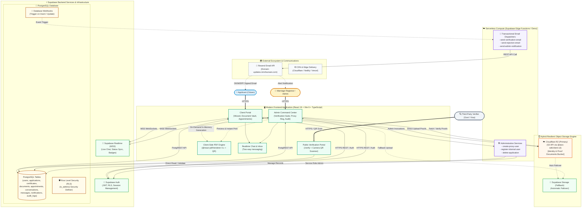

# MMR Burwan - Marriage Registration Portal


**MMR Burwan** (Marriage Registrar Burwan) is a comprehensive, enterprise-grade digital platform designed to digitize and streamline the marriage registration process for the region of Burwan. It replaces legacy manual paperwork with a secure, transparent, and automated digital workflow, serving both citizens (applicants) and government officials (administrators).

---

## 📚 Table of Contents
1. [Project Overview](#-project-overview)
2. [System Architecture](#-system-architecture)
3. [Key Features & Workflows](#-key-features--workflows)
4. [Database Schema & Data Model](#-database-schema--data-model)
5. [Security & Privacy](#-security--privacy)
6. [Folder Structure](#-folder-structure)
7. [Getting Started & Deployment](#-getting-started--deployment)

---

## 🔭 Project Overview

The platform serves three primary user groups with distinct interfaces and permissions:

### 1. Applicants (Citizens)
- **Digital Application**: A guided, multi-step wizard to submit marriage details (Groom, Bride, Witnesses).
- **Document Vault**: Secure upload and management of ID proofs (Aadhaar, Voter ID, etc.).
- **Appointment Booking**: Real-time slot booking for physical verification at the registrar's office.
- **Status Tracking**: Live updates on application status (Draft → Submitted → Verified/Rejected).
- **Realtime Chat**: Direct two-way messaging with the registrar's office.
- **Certificate Access**: Instant download of digitally signed marriage certificates.

### 2. Administrators (Officials)
- **Command Center**: A dashboard view of all applications with filtering and sorting.
- **Proxy Applications**: Ability to create accounts and applications on behalf of citizens (Walk-in applicants).
- **Verification Suite**: Tools to view documents side-by-side with application data for verification.
- **Rejection Management**: Granular rejection system with automated email notifications explaining the reason.
- **Certificate Issuance**: 
    - One-click generation of unique, traceable certificate numbers.
    - Automatic PDF generation with QR codes.
    - Strict duplicate prevention and history management.

### 3. Public & Third-Party Verifiers
- **Public Verification Portal**: Accessible at `/verify` for government offices, visa agencies, or employers to verify marriage certificates.
- **In-Browser Camera Scanner**: Built-in camera scanner powered by `html5-qrcode` & `jsqr` to instantly decode certificate QR codes.
- **Tamper-Evident Records**: Live database lookup to validate certificate authenticity and issuance history.

---

## 🏗 System Architecture

The project follows a modern, highly decoupled **Serverless & Edge-First Architecture** combining the **Supabase** backend-as-a-service ecosystem, **Cloudflare R2** object storage, and a high-performance **React 19** frontend. This ensures sub-second responses, high availability, tamper-evident security, and zero infrastructure management overhead.

### Tech Stack

- **Frontend**: 
    - **Framework**: **React 19** (`^19.2.0`) with **Vite 6** (`^6.2.0`) for lightning-fast HMR and optimized tree-shaken production bundles.
    - **Language**: **TypeScript 5.8** for strict compile-time type safety across routes, services, and models.
    - **Styling & UI**: **Tailwind CSS** with utility-first responsive styling, **Lucide React** icon system, and **Lottie React** animations.
    - **State Management**: **React Context API** for scoped state (Auth, Realtime Chat, Notifications).
    - **Forms & Validation**: `react-hook-form` paired with `zod` and `@hookform/resolvers` for multi-step wizard schema validation.
    - **PDF & Certificate Engine**: `@react-pdf/renderer` 4.x for client-side generation of digitally sealed, print-ready A4 marriage certificates and acknowledgement slips.
    - **Dynamic QR Code Generation**: `qrcode.react` and `qrcode` for generating cryptographically signed, verifiable QR codes on certificates.
    - **Optical Camera Scanner**: `html5-qrcode` & `jsqr` powering real-time camera scanning for certificate verification.
    - **Image Manipulation**: `react-easy-crop` for standard portrait and joint photo cropping.
    - **Internationalization**: `react-i18next` with full English and Bengali (`bn`) localization.
    - **Testing**: `Vitest 3` and `React Testing Library`.

- **Backend & BaaS (Supabase Platform)**: 
    - **Database**: **PostgreSQL** with Row Level Security (RLS) policies and `is_admin()` Security Definer functions.
    - **Authentication**: **Supabase Auth** supporting JWT session handling, Magic Links, Passcode-based login, and role-based access.
    - **Realtime (WSS)**: **Supabase Realtime WebSockets** powering two-way applicant-admin chat (`messages`, `conversations`), application status syncing, and live unread notification counters.
    - **Database Webhooks**: Automated trigger pipelines dispatched to serverless functions on application verification and document rejection events.

- **Storage Layer (Resilient Hybrid Engine)**: 
    - **Primary Engine**: **Cloudflare R2** (S3-compatible object storage via AWS S3 SDK `@aws-sdk/client-s3` and presigner `@aws-sdk/s3-request-presigner`) with dedicated public/signed subdomains for documents and certificates.
    - **Failover Engine**: Automatic client-side fallback to **Supabase Storage** if R2 credentials or network requests encounter errors.

- **Compute & Serverless (Supabase Edge Functions)**: 
    - **Runtime**: **Deno-based Edge Functions** for secure server-side logic:
      - `send-verification-email`: Webhook-triggered email dispatch upon application approval.
      - `send-rejection-email`: Webhook-triggered rejection notifications with document correction guidance.
      - `send-admin-notification`: Dispatches email alerts to administrators on new walk-in or online submissions.
      - `create-proxy-user`: Administrative endpoint to safely create walk-in applicant accounts.
      - `register-internal-user`: Internal user onboarding.
      - `delete-application`: Cascade administrative application removal.

- **Communication & Delivery**: 
    - **Email Engine**: **Resend API** with SPF/DKIM authenticated domain (`updates.mmrburwan.com`) delivering responsive HTML transactional templates.
    - **Edge Hosting**: **Netlify / Vercel** CDN edge hosting with automated SPA rewrite rules and HTTP security headers.

### Architecture Diagram


```mermaid
graph TD
    %% Styles
    classDef user fill:#e0f2fe,stroke:#0284c7,stroke-width:2px;
    classDef admin fill:#fef3c7,stroke:#d97706,stroke-width:2px;
    classDef verifier fill:#f1f5f9,stroke:#475569,stroke-width:2px;
    classDef client fill:#ecfdf5,stroke:#059669,stroke-width:2px;
    classDef edge fill:#f5f3ff,stroke:#7c3aed,stroke-width:2px;
    classDef supabase fill:#f0fdf4,stroke:#16a34a,stroke-width:2px;
    classDef db fill:#fffbeb,stroke:#b45309,stroke-width:2px;
    classDef r2 fill:#fff7ed,stroke:#ea580c,stroke-width:2px;
    classDef ext fill:#f8fafc,stroke:#334155,stroke-width:1.5px,stroke-dasharray: 4 4;

    %% External Actors
    User(["👤 Applicant (Citizen)"]):::user
    Admin(["👮 Marriage Registrar / Admin"]):::admin
    Verifier(["🔍 Third-Party Verifier (Govt / Visa)"]):::verifier

    %% Frontend Tier
    subgraph Frontend ["🖥️ Modern Frontend Application (React 19 + Vite 6 + TypeScript)"]
        direction TB
        ClientApp["Client Portal<br/>(Wizard, Document Vault, Appointments)"]:::client
        AdminApp["Admin Command Center<br/>(Verification Suite, Proxy Reg, Audit)"]:::client
        VerifyApp["Public Verification Portal<br/>(/verify + Camera QR Scanner)"]:::client
        PDFEngine["Client-Side PDF Engine<br/>(@react-pdf/renderer 4.x + QR)"]:::client
        ChatModule["Realtime Chat & Inbox<br/>(Two-way messaging)"]:::client
    end

    %% Network Connections from Actors
    User ==>|HTTPS| ClientApp
    Admin ==>|HTTPS| AdminApp
    Verifier ==>|HTTPS / QR Scan| VerifyApp

    %% Storage Layer
    subgraph StorageEngine ["🗄️ Hybrid Resilient Object Storage Engine"]
        direction TB
        R2["☁️ Cloudflare R2 (Primary)<br/>(S3 API via @aws-sdk/client-s3)<br/>[Identity & Proof Documents Bucket]"]:::r2
        SupaStorage["📂 Supabase Storage (Fallback)<br/>(Automatic Failover)"]:::supabase
    end

    %% Supabase BaaS
    subgraph SupabasePlatform ["⚡ Supabase Backend Services & Infrastructure"]
        direction TB
        Auth["🔐 Supabase Auth<br/>(JWT, RLS, Session Management)"]:::supabase
        Realtime["📡 Supabase Realtime (WSS)<br/>(Live Chat, Status Sync, Badges)"]:::supabase
        
        subgraph DataTier ["💾 PostgreSQL Database"]
            DB[("PostgreSQL Tables<br/>(users, applications, certificates,<br/>documents, appointments, conversations,<br/>messages, notifications, audit_logs)")]:::db
            RLS["🛡️ Row Level Security (RLS)<br/>(is_admin() Security Definer)"]:::db
            Webhooks["🔔 Database Webhooks<br/>(Trigger on Insert / Update)"]:::db
        end
    end

    %% Serverless Compute Tier
    subgraph ServerlessTier ["☁️ Serverless Compute (Supabase Edge Functions / Deno)"]
        direction TB
        EmailFns["📧 Transactional Email Dispatchers<br/>- send-verification-email<br/>- send-rejection-email<br/>- send-admin-notification"]:::edge
        AdminFns["🛠️ Administrative Services<br/>- create-proxy-user<br/>- register-internal-user<br/>- delete-application"]:::edge
    end

    %% External Ecosystem
    subgraph ExternalEcosystem ["🌍 External Ecosystem & Communications"]
        Resend["📧 Resend Email API<br/>(Domain: updates.mmrburwan.com)"]:::ext
        CDN["🌐 CDN & Edge Delivery<br/>(Cloudflare / Netlify / Vercel)"]:::ext
    end

    %% Connections: Frontend to Backend
    ClientApp <-->|HTTPS REST / Auth| Auth
    AdminApp <-->|HTTPS REST / Auth| Auth
    ClientApp <-->|WSS WebSockets| Realtime
    AdminApp <-->|WSS WebSockets| Realtime
    ClientApp <-->|PostgREST API| DB
    AdminApp <-->|PostgREST API| DB
    VerifyApp -->|Direct Read / Validate| DB

    %% Frontend Internal Workflows
    ClientApp --> ChatModule
    AdminApp --> ChatModule
    ClientApp -.->|On-Demand In-Memory Generation| PDFEngine
    AdminApp -.->|Preview & Instant Print| PDFEngine

    %% Storage Upload & Fetch
    ClientApp -->|Direct Upload Proofs| R2
    AdminApp -->|Fetch / Verify Proofs| R2
    R2 -.->|Auto Failover| SupaStorage
    ClientApp -.->|Fallback Upload| SupaStorage

    %% Webhook and Serverless Flows
    Webhooks -.->|Event Trigger| EmailFns
    AdminApp -->|Admin Invocations| AdminFns
    AdminFns -->|Service Role Admin| Auth
    AdminFns -->|Manage Records| DB

    %% Notifications & External Dispatch
    EmailFns -->|REST API Call| Resend
    Resend -.->|DKIM/SPF Signed Email| User
    Resend -.->|Alert Notification| Admin

    %% Click Interactions
    click ClientApp "https://mmrburwan.com" "Go to MMR Burwan Portal"
    click VerifyApp "https://mmrburwan.com/verify" "Open Verification Suite"
```

---

## 🚀 Key Features & Workflows

### A. The Application Lifecycle
1.  **Drafting**: Users start an application. Data is validated strictly using `Zod` schemas.
2.  **Submission**: Once submitted, the application is locked and moves to the Admin queue.
3.  **Review**: Admins review the data.
    - **Rejection**: Status reverts, user is notified via email to correct specific errors.
    - **Verification**: Status becomes `verified`. Certificate is issued with unique serial number.

### B. Event-Driven Notification System
We utilize an **Event-Driven Architecture** to decouple the frontend from side effects.
- **Mechanism**: 
    1. Admin performs an action (e.g., rejects a document).
    2. Frontend inserts a record into the `notifications` table.
    3. **Database Webhook** triggers an **Edge Function**.
    4. Email is sent via Resend.
- **Benefit**: Ensures reliability even if the client-side session is interrupted.

### C. On-Demand In-Memory Certificate Architecture
- **Dynamic In-Memory Generation**: Certificates and acknowledgement slips are generated on-demand directly within the client using `@react-pdf/renderer` 4.x and dynamic QR codes (`qrcode.react`), eliminating the security and storage overhead of storing static PDFs on cloud servers.
- **Live Database Ground Truth**: Certificate metadata (serial number, registration date, party names, registrar credentials) is drawn directly from verified PostgreSQL records, guaranteeing zero stale cached files.
- **Tamper-Evident QR Verification**: Each certificate embeds a tamper-proof verification URL (`/verify?id=...`) pointing to the official registry record.
- **Granular Download Control**: An administrative permission flag (`canDownload`) allows the registrar to selectively enable or lock applicant certificate download access.

---

## 💾 Database Schema & Data Model

The core data model is built on **PostgreSQL** within Supabase. Key tables include:

| Table Name | Description | Key Relationships |
| :--- | :--- | :--- |
| `users` | Extends Supabase Auth with app-specific profile data. | `id` references `auth.users` |
| `applications` | The central record for a marriage registration. | `user_id` references `users` |
| `certificates` | Stores issued certificate metadata and file URLs. | `application_id` references `applications` |
| `documents` | Metadata for uploaded identity and proof files. | `belongs_to` references `applications` |
| `appointments` | Booking slots and status for in-person verification. | `user_id` references `users` |
| `conversations` | Realtime messaging threads between applicants and admin. | `user_id` references `users`, `admin_id` references `users` |
| `messages` | Individual chat messages with read status and timestamps. | `conversation_id` references `conversations` |
| `notifications` | System alerts and transactional email trigger logs. | `user_id` references `users` |
| `audit_logs` | Security and administrative action audit trail. | `admin_id` references `users` |

---

## 🛡 Security & Privacy

1.  **Row Level Security (RLS)**:
    - **Applicants** can ONLY access their own data (`auth.uid() = user_id`).
    - **Admins** have elevated privileges via a custom `is_admin()` Security Definer function.
    
2.  **Resilient Dual Storage**:
    - Primary documents and certificates are stored in **Cloudflare R2** (S3-compatible object storage via `@aws-sdk/client-s3`).
    - Automatic fallback to **Supabase Storage** if R2 is unavailable.
    - Protected documents accessed via short-lived **Signed URLs**.

3.  **Validation**:
    - Strict backend and client-side validation prevents duplicate certificate numbers and tampering.

---

## 📂 Folder Structure

```
mmr-burwan/
├── components/           # Reusable UI & feature components
│   ├── admin/            # Admin command center (tables, modals, audit)
│   ├── application/      # Multi-step marriage application wizard
│   ├── certificate/      # @react-pdf/renderer certificate & slip templates
│   └── ui/               # Design system elements (Buttons, Badges, Modals)
├── contexts/             # Global application state (Auth, Notifications, Realtime Chat)
├── data/                 # Static references (Districts, Options, Lottie animations)
├── hooks/                # Custom React hooks (Debounce, Media queries, Realtime)
├── lib/                  # Infrastructure clients (Supabase client, Cloudflare R2 / S3 client)
├── pages/                # Route pages
│   ├── admin/            # Admin pages (Dashboard, Verification, Scanner, Chat)
│   └── dashboard/        # Applicant pages (Application, Status, Vault, Appointments)
├── services/             # Domain service layer (admin, auth, certificates, documents, messages)
├── supabase/
│   ├── functions/        # Deno Serverless Edge Functions (emails, proxy users, alerts)
│   └── storage-policies.sql # Storage RLS definitions
├── types/                # Strict TypeScript schemas and interfaces
├── utils/                # Helper utilities (certificateGenerator, formatters)
└── public/               # Static web assets, icons, manifest, favicon suite
```

---

## 🚦 Getting Started & Deployment

### Prerequisites
- Node.js (v18+)
- Supabase CLI

### Local Development

1.  **Clone the repository**
    ```bash
    git clone https://github.com/yourusername/mmr-burwan.git
    cd mmr-burwan
    ```

2.  **Install dependencies**
    ```bash
    npm install
    ```

3.  **Environment Setup**
    Create a `.env` file:
    ```env
    VITE_SUPABASE_URL=your_project_url
    VITE_SUPABASE_ANON_KEY=your_anon_key
    ```

4.  **Run Locally**
    ```bash
    npm run dev
    ```

5.  **Run Tests**
    ```bash
    npm run test
    ```

### Deployment

1.  **Frontend**: Deploy to Vercel, Netlify, or any static host.
2.  **Backend**:
    - Link your local project to your Supabase project:
      ```bash
      supabase link --project-ref your-project-id
      ```
    - Push database migrations:
      ```bash
      supabase db push
      ```
    - Deploy Edge Functions:
      ```bash
      supabase functions deploy
      ```

---

## 📄 License

This project is licensed under the MIT License.
